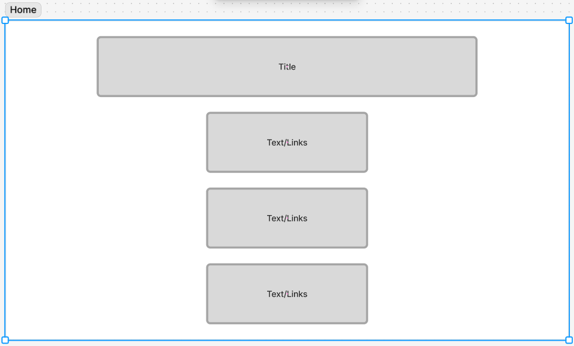

# Python for beginners

## About This Project

...

## Reflection

Sam - This was a group assignment where we had to do research on something we hadn't learned while on this course and present it to the class so they could use it. We came to the decision to pick Python as it's something we have both seen a lot in job ads along with other languages. We wanted to keep it simple and beginner-friendly so anyone who looked at our documentation could understand the basics of Python and also know the slight differences between Python and JavaScript. Overall, I feel like this assignment went really well. Gabby and I worked really well together, and we both walked away from this assignment with improved skills in working in a group.

## What We Learned

Sam - I feel like I've learnt a lot this week. I now have a good understanding of Python basics and know the key differences between Python and JavaScript, build upon my team skills, paired programming, and improve my communication skills.

## blockers

...

## What went really well?

...

## Wireframe

## External sources

#### Youtube videos

[Python or JavaScript - Which One Should YOU Learn?](https://www.youtube.com/watch?v=t9CAFYn7YgY) , [How to Install PIP in Python](https://www.youtube.com/watch?v=TqE4jBH4Me4&t=117s) , [Python Tutorial for Beginners with VS Code 🐍](https://www.youtube.com/watch?v=6i3e-j3wSf0) , [Getting Started with Python in VS Code (Official Video)](https://www.youtube.com/watch?v=D2cwvpJSBX4) , [How to Create a Flask + React Project with Vite](https://www.youtube.com/watch?v=ctQMqqEo4G8) , [A brief Introduction to Flask](https://www.youtube.com/watch?v=AgVqsmz-ZW4)

#### Documentation

[What is Flask Python](https://pythonbasics.org/what-is-flask-python/) , [Flask (web framework)](https://en.wikipedia.org/wiki/Flask_%28web_framework%29#:~:text=Flask%20is%20a%20micro%20web,party%20libraries%20provide%20common%20functions) , [python.org](https://www.python.org/doc/) , [The Python Tutorial](https://docs.python.org/3/tutorial/index.html) , [Python HOWTOs](https://docs.python.org/3/howto/index.html)
